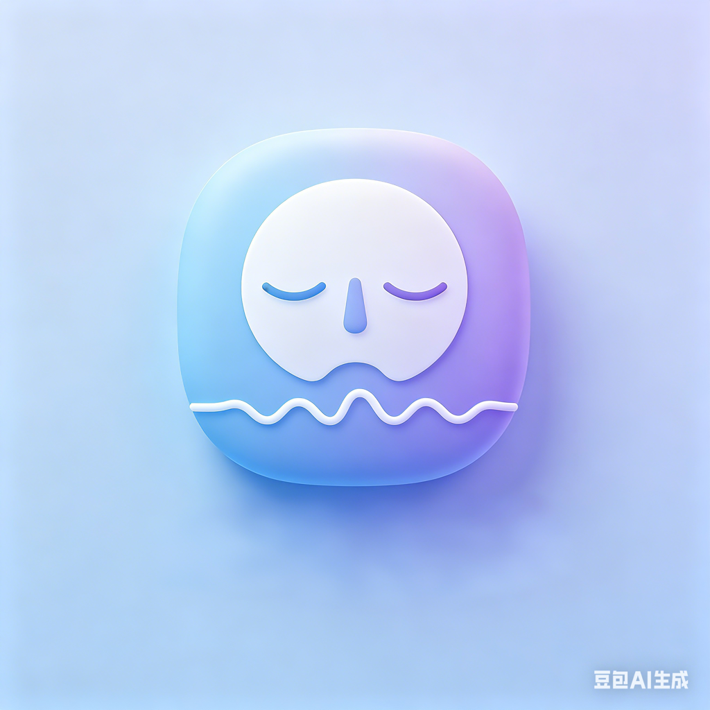

# 便携微冥想 · Pocket Micro Meditation

<p align="center">
  
</p>

<p align="center">
  <strong>1 分钟极速焦虑疏导 · One-minute calm reset</strong>
</p>

<p align="center">
  
  
  
  
</p>

<p align="center">
  <a href="https://xjalyn.github.io/mini-meditation-breath-v0/">🌐 在线主页</a>
</p>

---

## 简介

**便携微冥想**是一款极简的呼吸冥想 iOS 应用，专注于 1 分钟快速焦虑疏导和专注力恢复。无需注册、无需联网，打开即用。

内置 10 种科学呼吸模式、6 种沉浸式背景音效、多种太空主题视觉风格，配合流畅的粒子动画与触感反馈，帮助你随时随地快速调节身心状态。

---

## 功能特性

### 呼吸模式（10 种）

| 模式 | 说明 | 免费/付费 |
|------|------|-----------|
| 4-7-8 呼吸法 | 经典放松呼吸法，帮助快速入睡和缓解焦虑 | 免费 |
| 箱式呼吸 | 压力管理呼吸法，提升专注力 | 免费 |
| 减压呼吸 | 温和的呼吸节奏，适合日常放松 | 付费 |
| 专注力呼吸 | 快速提升专注力和警觉性 | 付费 |
| 活力呼吸 | 快速提升能量和活力 | 付费 |
| 助眠呼吸 | 深度放松，帮助入睡 | 付费 |
| 共振呼吸 | 平衡神经系统，提升心率变异性 | 付费 |
| 长叹舒缓 | 模拟生理长叹，快速消解压力 | 付费 |
| 快速镇定 | 阻断恐慌发作，重建安全感 | 付费 |
| 深度释放 | 深长呼吸，彻底释放全天疲惫 | 付费 |

### 背景音乐（6 种）

- 森林鸟鸣 · 海浪轻拍 · 细雨轻声 · 微风拂面 · 冥想铃声 · 氛围音乐

### 视觉主题

- 多种太空主题配色，支持呼吸练习中实时切换

### 交互体验

- Canvas 粒子动画，呼吸节奏实时可视化
- 触感震动（Haptic Feedback）引导，静音环境同样可用
- 中英文双语自适应

## 应用截图

<p align="center">
  
  
  
  
</p>

---

## 技术栈

- **SwiftUI** — 声明式 UI 框架
- **Canvas + TimelineView** — 高性能粒子动画
- **AVFoundation** — 背景音乐播放与循环
- **StoreKit 2** — 应用内购买（非消耗型）
- **Combine** — 响应式数据流
- **XcodeGen** — 使用 `project.yml` 生成 Xcode 项目文件

---

## 快速开始

### 前置条件

- macOS 运行 Xcode 14.0 或更高版本
- iOS 16.0+ 模拟器或真机

### 安装与运行

```bash
# 克隆仓库
git clone https://github.com/your-username/breathing-app.git
cd breathing-app

# 安装 XcodeGen（如果尚未安装）
brew install xcodegen

# 生成 Xcode 项目文件
xcodegen generate

# 打开项目
open BreathingApp.xcodeproj
```

在 Xcode 中选择目标设备（模拟器或真机），按 `Cmd + R` 运行。

### 替换背景音乐

项目内置了免版权 WAV 音频。如需替换为自己的音频文件，请将同名 `.wav` 文件放入 `BreathingApp/BreathingApp/Resources/Music/` 目录，详见 [MUSIC_GUIDE.md](MUSIC_GUIDE.md)。

---

## 项目结构

```
BreathingApp/
├── BreathingApp/
│   ├── Models/
│   │   └── BreathingPattern.swift          # 呼吸模式数据模型（10种）
│   ├── Views/
│   │   ├── BreathingAnimationView.swift     # Canvas 粒子动画组件
│   │   ├── BreathingView.swift             # 呼吸练习主界面
│   │   ├── MusicSelectionView.swift         # 背景音乐选择
│   │   └── PatternSelectionView.swift      # 模式选择首页
│   ├── Services/
│   │   ├── HapticFeedback.swift            # 触感震动反馈
│   │   ├── Localization.swift              # 中英文双语适配
│   │   ├── MusicManager.swift              # 背景音乐管理
│   │   └── StoreManager.swift              # StoreKit 2 内购管理
│   ├── Resources/
│   │   ├── Assets.xcassets/                # 图片与颜色资源
│   │   └── Music/                          # 内置 WAV 音频文件
│   ├── BreathingAppApp.swift               # App 入口
│   └── Info.plist                          # 应用配置
├── project.yml                              # XcodeGen 项目配置
└── .gitignore
```

---

## 应用内购买

本项目采用单一非消耗型内购产品：

- **Product ID**: `com.xujie.breathingapp.premium`
- **价格**: ¥6.00
- **说明**: 一次购买，永久解锁全部 8 种付费呼吸模式

如需配置或修改内购，请参考 [IN_APP_PURCHASE_GUIDE.md](IN_APP_PURCHASE_GUIDE.md)。

---

## 目标用户

- 高强度脑力劳动者
- 考试考证焦虑人群
- 情绪易波动群体
- 需要快速专注恢复的用户

---

## 设计理念

- **极简主义** — 无废话引导，打开即用
- **视觉引导** — 流畅动画替代音频/视频引导
- **触感反馈** — 静音环境下也能有效使用
- **即时可用** — 无需下载额外资源，无需联网

---

## 贡献指南

欢迎提交 Issue 和 Pull Request。

1. Fork 本仓库
2. 创建特性分支 (`git checkout -b feature/amazing-feature`)
3. 提交更改 (`git commit -m 'Add some amazing feature'`)
4. 推送到分支 (`git push origin feature/amazing-feature`)
5. 创建 Pull Request

---

## 许可证

本项目采用 [MIT](LICENSE) 许可证。你可以自由使用、修改和分发本项目代码。

---

## 作者

<p align="center">
  
</p>

<p align="center">
  <strong></strong>
</p>

<p align="center">
  独立开发者，热爱 SwiftUI 和产品设计。
</p>

---

## 联系方式

如有问题或建议，欢迎通过 Issue 与我联系。